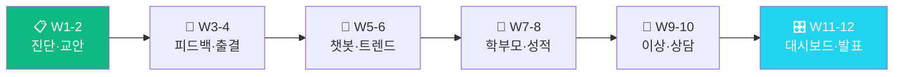

<div align="center">

# 📚 교육·학원 AX 마스터클래스

### "AI로 수업부터 학부모 소통까지 자동화하는 12주 교육 AX"

**교안생성·성적이상감지·학부모알림 — 학원 데이터로 직접 검증**

[](https://github.com/Reasonofmoon/hexa-4)
[](https://github.com/Reasonofmoon/hexa-4/tree/main/notebooks)
[](https://github.com/Reasonofmoon/hexa-4)
[](https://aistudio.google.com/)
[](LICENSE)

> **"레벨테스트 문항 만들기, 개인 피드백 작성, 학부모 알림 문자... 매일 저녁 2~3시간이 사라진다." 이 과정이 끝나면 자동화됩니다.**

[🚀 W1 바로 시작](https://colab.research.google.com/github/Reasonofmoon/hexa-4/blob/main/notebooks/W01_edu_diagnosis.ipynb) · [📂 전체 노트북](notebooks/) · [🔧 CLI 스크립트](scripts/) · [🐛 이슈](../../issues)

</div>

---

## 🧠 Philosophy — "왜 교육/학원 AX인가"

기존 AI 교육의 문제: **이론만 있고 현장 데이터가 없다**.

| 기준 | 기존 AI 교육 | 교육·학원 AX 마스터클래스 |
|------|-------------|---|
| 데이터 | 가상의 샘플 데이터 | **교육/학원 현장 CSV** |
| 결과물 | 모델 정확도 숫자 | **경영진 보고서 + 자동화 파이프라인** |
| 난이도 | Python 필수 | **Colab 실행만으로 완성** |
| 기간 | 3개월+ 이론 | **W1부터 당일 실전 결과** |
| 연결성 | 개별 실습 | **W1→W12 자동화 파이프라인** |



---

## ⚙️ 12주 커리큘럼

### Layer 1 · Foundation (W1~W4) — AI 기초 도구화

> **Wow**: 수업 교안 30페이지 **3분** 만에 커리큘럼 맞춤 생성

| 주차 | 주제 | 핵심 출력물 | Colab |
|----|------|------------|-------|
| **W1** | 학원 AX 자가진단 | 10항목 레이더 · 학원 AI 전환 로드맵 | [](https://colab.research.google.com/github/Reasonofmoon/hexa-4/blob/main/notebooks/W01_edu_diagnosis.ipynb) |
| **W2** | 수업 교안 자동화 | 주차별 교안 · 학습목표·활동·숙제 생성 | [](https://colab.research.google.com/github/Reasonofmoon/hexa-4/blob/main/notebooks/W02_edu_lesson_plan.ipynb) |
| **W3** | 학생 피드백 자동화 | 개인별 맞춤 피드백 5종 · 격려문자 초안 | [](https://colab.research.google.com/github/Reasonofmoon/hexa-4/blob/main/notebooks/W03_edu_feedback.ipynb) |
| **W4** | 출결 관리 자동화 | 결석 패턴 분석 · 학부모 알림 문자 생성 | [](https://colab.research.google.com/github/Reasonofmoon/hexa-4/blob/main/notebooks/W04_edu_attendance.ipynb) |

### Layer 2 · Analytics (W5~W8) — 데이터 기반 의사결정

> **Wow**: 성적 하락 학생 자동 감지 → 학부모 문자 초안 **즉시** 생성

| 주차 | 주제 | 핵심 출력물 | Colab |
|----|------|------------|-------|
| **W5** | AI 학원 챗봇 | FAQ 자동 응답 · 입학 문의 처리 봇 | [](https://colab.research.google.com/github/Reasonofmoon/hexa-4/blob/main/notebooks/W05_edu_chatbot.ipynb) |
| **W6** | 성적 트렌드 분석 | 월별 성적 라인차트 · 하락생 자동 탐지 | [](https://colab.research.google.com/github/Reasonofmoon/hexa-4/blob/main/notebooks/W06_edu_learning_trend.ipynb) |
| **W7** | 학부모 알림 자동화 | 행사·성적·상담 알림 문자 3종 자동화 | [](https://colab.research.google.com/github/Reasonofmoon/hexa-4/blob/main/notebooks/W07_edu_parent_notification.ipynb) |
| **W8** | 성적 Sheets 연동 | 성적 Google Sheets 업로드 · CSV fallback | [](https://colab.research.google.com/github/Reasonofmoon/hexa-4/blob/main/notebooks/W08_edu_grade_sheets.ipynb) |

### Layer 3 · Intelligence (W9~W12) — 자동화 운영 시스템

> **Wow**: 12주 학원 운영 성과를 **경영진 보고서 한 장**으로 자동 정리

| 주차 | 주제 | 핵심 출력물 | Colab |
|----|------|------------|-------|
| **W9** | 학습 이상 감지 | 성적 하락 3σ 감지 · 경보+피드백 자동 | [](https://colab.research.google.com/github/Reasonofmoon/hexa-4/blob/main/notebooks/W09_edu_learning_anomaly.ipynb) |
| **W10** | 학부모 상담 자동화 | 상담 의제 · 피드백 보고서 자동 생성 | [](https://colab.research.google.com/github/Reasonofmoon/hexa-4/blob/main/notebooks/W10_edu_parent_meeting.ipynb) |
| **W11** | 교육 종합 대시보드 | 성적·출결·상담 4패널 · AI 분석 | [](https://colab.research.google.com/github/Reasonofmoon/hexa-4/blob/main/notebooks/W11_edu_dashboard.ipynb) |
| **W12** | 12주 성과 Cockpit | 학원 KPI 비교 · 경영진·학부모 보고서 | [](https://colab.research.google.com/github/Reasonofmoon/hexa-4/blob/main/notebooks/W12_edu_cockpit.ipynb) |

---

## 🎯 수준별 활용 가이드

### 🟢 Starter — "5분 안에 첫 AI 결과"
> AX 진단점수 10~24점 · 코딩 경험 없음

1. [W1 노트북](https://colab.research.google.com/github/Reasonofmoon/hexa-4/blob/main/notebooks/W01_edu_diagnosis.ipynb) 클릭 → Google Colab에서 열기
2. `GEMINI_API_KEY` 입력 ([발급](https://aistudio.google.com/apikey))
3. 학원명·과목 입력 → AX 진단 레이더 차트
4. `Ctrl+F9` (전체 실행) → 결과 자동 다운로드

### 🔵 Professional — "실제 데이터로 실전 분석"
> AX 진단점수 25~39점 · 기초 Excel 가능

1. `shared/edu_students_sample.csv` 구조 확인
2. 성적 CSV 업로드 → 하락생 감지 + 학부모 문자 초안
3. W7~W8에서 Slack/Sheets 연결
4. W9~W10으로 이상감지·소통 자동화 구축

### 🟣 Enterprise — "12주 파이프라인 & 팀 표준화"
> AX 진단점수 40~50점 · 자동화 확장 목표

1. W11 대시보드 → 성적·출결·상담 통합 모니터링
2. W12 보고서를 정기 자동화 스케줄로 전환
3. 다른 hexa 시리즈와 교차 벤치마킹

---

## 🔧 확장 우선순위

| 우선순위 | 커스터마이징 | 난이도 | 영향 범위 |
|----------|--------------|--------|----------|
| **1st** | 학원 정보 입력 | ⭐ | 이름·과목·대상 |
| **2nd** | 학생 CSV 실제 데이터 | ⭐⭐ | 분석 전체 |
| **3rd** | 카카오 알림 API 연결 | ⭐⭐ | 학부모 소통 |
| **4th** | Sheets 성적 연동 | ⭐⭐⭐ | 실시간 대시보드 |
| **5th** | W12 월간 자동 보고 | ⭐⭐⭐ | 원장·학부모 자동 리포트 |

---

## 📂 프로젝트 구조

```
hexa-4/
├── notebooks/          ← 12주 Colab 실습 노트북 (W01~W12)
│   ├── W01_edu_diagnosis.ipynb                       # W1: 학원 AX 자가진단
│   ├── W02_edu_lesson_plan.ipynb                     # W2: 수업 교안 자동화
│   ├── W03_edu_feedback.ipynb                        # W3: 학생 피드백 자동화
│   ├── W04_edu_attendance.ipynb                      # W4: 출결 관리 자동화
│   ├── W05_edu_chatbot.ipynb                         # W5: AI 학원 챗봇
│   ├── W06_edu_learning_trend.ipynb                  # W6: 성적 트렌드 분석
│   ├── W07_edu_parent_notification.ipynb             # W7: 학부모 알림 자동화
│   ├── W08_edu_grade_sheets.ipynb                    # W8: 성적 Sheets 연동
│   ├── W09_edu_learning_anomaly.ipynb                # W9: 학습 이상 감지
│   ├── W10_edu_parent_meeting.ipynb                  # W10: 학부모 상담 자동화
│   ├── W11_edu_dashboard.ipynb                       # W11: 교육 종합 대시보드
│   ├── W12_edu_cockpit.ipynb                         # W12: 12주 성과 Cockpit
├── scripts/            ← CLI Python 스크립트 (교안생성 · 피드백 · 학부모알림)
├── shared/             ← 실습 데이터 (edu_students_sample.csv)
└── labs/               ← 보조 실습 가이드
```

---

## 🚀 빠른 시작

```bash
git clone https://github.com/Reasonofmoon/hexa-4.git && cd hexa-4
pip install google-generativeai pandas matplotlib numpy  # 로컬 실행 시
```

[](https://colab.research.google.com/github/Reasonofmoon/hexa-4/blob/main/notebooks/W01_edu_diagnosis.ipynb)
[](https://colab.research.google.com/github/Reasonofmoon/hexa-4/blob/main/notebooks/W02_edu_lesson_plan.ipynb)
[](https://colab.research.google.com/github/Reasonofmoon/hexa-4/blob/main/notebooks/W03_edu_feedback.ipynb)
[](https://colab.research.google.com/github/Reasonofmoon/hexa-4/blob/main/notebooks/W04_edu_attendance.ipynb)

---

## 🔗 전체 AX 시리즈 (hexa-1~6)

| 레포 | 섹터 | 핵심 AI 자동화 | 링크 |
|------|------|--------------|------|
| **hexa-1** | 🏭 제조업 | 불량분류·OEE·예지보전 | [→](https://github.com/Reasonofmoon/hexa-1) |
| **hexa-2** | 🍽️ F&B | 리뷰분석·메뉴카피·재고예측 | [→](https://github.com/Reasonofmoon/hexa-2) |
| **hexa-3** | 🛒 소매/이커머스 | 상품카피·CRM·SEO분석 | [→](https://github.com/Reasonofmoon/hexa-3) |
| **hexa-4** (현재) | 📚 교육/학원 | 교안자동화·성적분석·챗봇 | — |
| **hexa-5** | 🏗️ 건설/시공 | 계약서·공정KPI·안전점검 | [→](https://github.com/Reasonofmoon/hexa-5) |
| **hexa-6** | 💼 IT서비스 | 제안서·코드리뷰·인시던트 | [→](https://github.com/Reasonofmoon/hexa-6) |

---

## 🌐 다국어 지원

| 항목 | 현황 |
|------|------|
| 노트북 UI | 🇰🇷 한국어 |
| 스크립트 출력 | 한국어 (컬럼 한/영 자동감지) |
| 샘플 데이터 | 한국어 컬럼명 |
| README | 한국어 / English (예정) |

---

*AX Consulting Curriculum © 2026 | Powered by Google Gemini 2.0 Flash*
